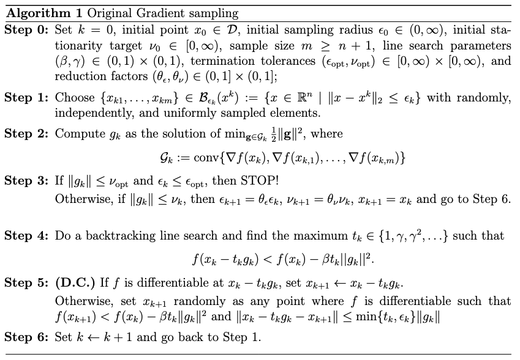

# Gradient Sampling Algorithm

This repository implements the **Gradient Sampling (GS) algorithm**, a powerful method for solving nonsmooth, nonconvex optimization problems.

Traditional gradient-based optimization methods can struggle when the objective function is not differentiable everywhere. The GS algorithm addresses this by sampling gradients in a neighborhood around the current point, forming a convex hull of these gradients, and then using this information to construct descent directions.

---

## 🔍 Algorithm Overview

The GS algorithm works by:

1. Sampling gradients of the objective function in a small ball around the current iterate.
2. Computing a generalized descent direction based on the convex hull of sampled gradients.
3. Performing a line search to ensure sufficient decrease.
4. Updating parameters and repeating until convergence.

The method is particularly useful for problems where the objective function is **locally Lipschitz but not differentiable everywhere**, such as in robust statistics, machine learning with ReLU networks, and piecewise-linear models.

---

## 📌 Pseudocode

The following pseudocode outlines the complete Gradient Sampling algorithm for minimizing an objective function $f : \mathbb{R}^n \rightarrow \mathbb{R}$ that is locally Lipschitz and continuously differentiable in an open set $\mathcal{D}$ with full measure in $\mathbb{R}^n$.

  

